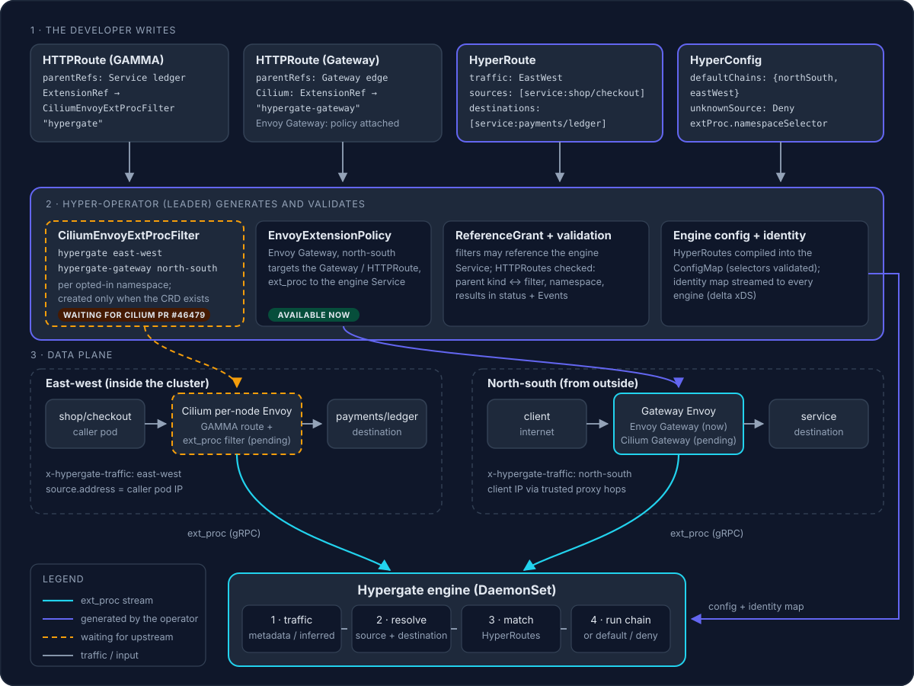
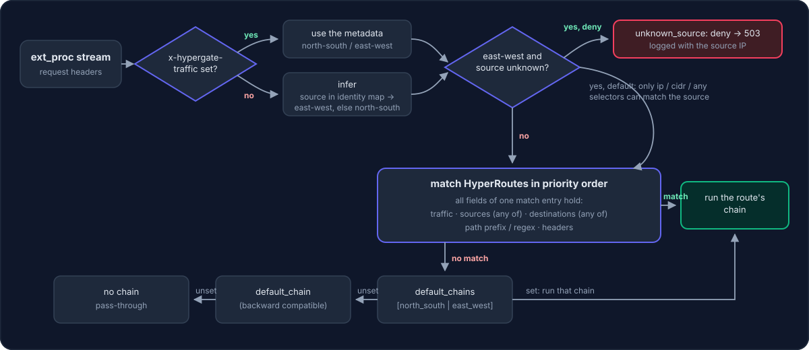
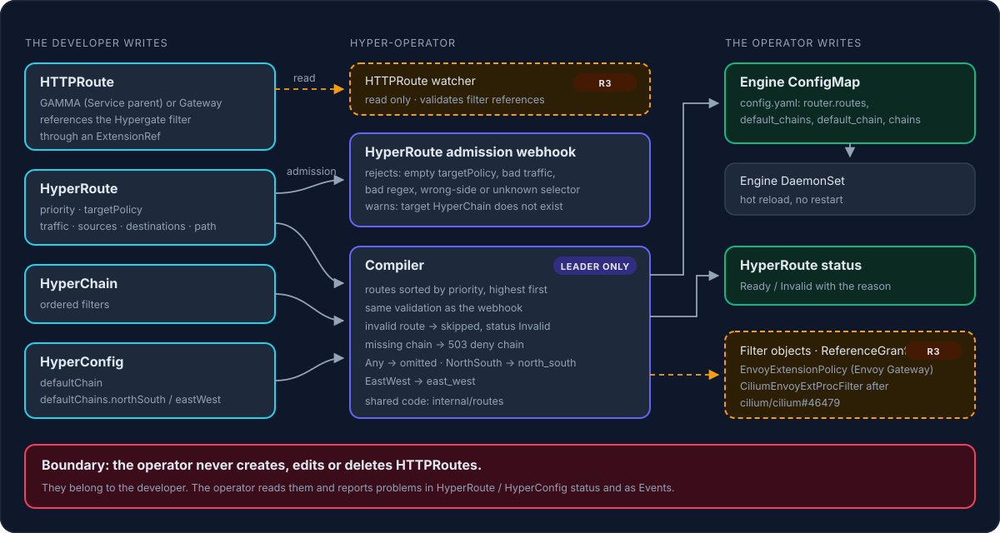

# Design: identity-aware routing (Gateway API + ext_proc)

| | |
| --- | --- |
| Status | **Approved** (revision 3). Phases R1–R3 done. Cilium attachment waits for upstream, and the current draft lacks fields Hypergate needs (see [§2.1](#21-upstream-pull-requests-we-are-waiting-for)). Envoy attachment on Cilium **waits for upstream** `CiliumEnvoyExtProcFilter` (see [§2.1](#21-upstream-pull-requests-we-are-waiting-for)); everything else proceeds |
| Depends on | Upstream: [cilium#45951](https://github.com/cilium/cilium/issues/45951) / [PR #46479](https://github.com/cilium/cilium/pull/46479). Internal: [workload identity distribution](./identity-distribution.md) Phases 2–4 (workload-based source selectors only) |
| Scope | Engine (selectors, router), HyperRoute / HyperConfig CRDs, operator (filter objects, ReferenceGrant, validation) |
| Revision | 3. ext_proc only. Revision 1 (CiliumEnvoyConfig) and revision 2 (ext_authz) are withdrawn |

## 1. Goal

Let a developer protect traffic **between two services** inside the cluster (east-west), and traffic from outside (north-south), with one policy model:

1. The developer creates a standard Gateway API `HTTPRoute`: attached to a **Service** for east-west traffic (GAMMA), or to a **Gateway** for north-south traffic. They attach Hypergate's **ext_proc** filter to it.
2. A `HyperRoute` says which callers (sources), reaching which targets (destinations), get which chain. Callers are named by what they are in the cluster: Service, service account, namespace, labels. IPs, CIDRs and hosts work too.
3. The engine, which already implements ext_proc, resolves identities, picks the chain and answers Envoy.



Amber, dashed parts depend on the upstream Cilium pull request; everything else works with current releases (Envoy Gateway for north-south today).

## 2. Integration decision

| Option | Status |
| --- | --- |
| `CiliumEnvoyConfig` (revision 1) | **Rejected.** Cilium documents it as an implementation detail: minimal validation, no conflict resolution, unpredictable when it overlaps Gateway-generated config, admin-only ([docs](https://docs.cilium.io/en/stable/network/servicemesh/l7-traffic-management/)). |
| Gateway API `ExternalAuth` / ext_authz (revision 2) | **Not pursued.** It would need a second protocol in the engine and loses response-phase features. |
| **ext_proc through Cilium's `CiliumEnvoyExtProcFilter`** | **Chosen, waiting for upstream.** A typed, validated CRD referenced from `HTTPRoute` `ExtensionRef`, GAMMA routes included. |
| ext_proc through **Envoy Gateway `EnvoyExtensionPolicy`** | **Supported now (approved).** The operator generates the policy for Gateway deployments, so north-south traffic is fully functional while Cilium's extension is pending. |
| ext_proc on standalone Envoy | **Works today** with a static filter config (`tests/envoy.yaml`). |

### 2.1 Upstream pull requests we are waiting for

> **Waiting on upstream.** East-west (GAMMA) attachment on Cilium, and Cilium Gateway attachment, start working once the pull request below is merged and released. Until then Hypergate is fully usable for north-south traffic through Envoy Gateway and standalone Envoy, and all engine/operator phases except R6 proceed.

| Upstream item | What it gives us | State (Oct 2026) |
| --- | --- | --- |
| [cilium/cilium#46479](https://github.com/cilium/cilium/pull/46479): implementation of `CiliumEnvoyExtProcFilter` | Typed ext_proc filter referenced from `HTTPRoute` `ExtensionRef`, **including GAMMA routes** | Draft; awaiting code-owner reviews (sig-k8s, sig-servicemesh, envoy, helm, docs) and upstream Gateway API payload-processing work |
| [cilium/cilium#45951](https://github.com/cilium/cilium/issues/45951): CFP "Support Gateway API ExtensionRef through `CiliumEnvoyExtProcFilter`" | Design of the above | Open |
| [cilium/cilium#30587](https://github.com/cilium/cilium/issues/30587): CFP "`HTTPRoute` `ExtensionRef` support for arbitrary L7 Envoy filters" | Earlier, broader proposal; context for #45951 | Open |

Draft API of #46479 as of head `35d016d` (checked October 2026): `cilium.io/v2alpha1`, kind `CiliumEnvoyExtProcFilter` (short name `ceepf`), namespaced. Spec fields: `backendRef` (`name`, optional `namespace` with a ReferenceGrant, `port`), `processingMode` (`requestHeaderMode`, `responseHeaderMode`, `requestBodyMode`, `responseBodyMode`, `requestTrailerMode`, `responseTrailerMode`) and `messageTimeout`. It is referenced via `ExtensionRef` (group `cilium.io`), GAMMA is supported, and it sits behind Helm value `gatewayAPI.enableExtensionRefFilters`. The repository's [`tasks/k8s.yaml`](../../tasks/k8s.yaml) already enables that flag.

> **Gap found in the current draft.** The generated Envoy filter has only `grpc_service` and `stat_prefix`. There are no `request_attributes`, no `allow_mode_override`, no `failure_mode_allow` setting and no gRPC `initial_metadata`. For Hypergate on Cilium this means:
>
> | Missing in the draft | Effect on Hypergate |
> | --- | --- |
> | `request_attributes` (`source.address`, `destination.address`) | No caller IP (only `X-Forwarded-For`, usually absent east-west) and no destination address, so source and destination selectors cannot work |
> | gRPC `initial_metadata` | No `x-hypergate-traffic`; the class must be inferred, which needs the identity map (Phase 4) |
> | `allow_mode_override` | A firewall filter with `inspect_body` cannot ask for the body; such requests fail closed with `500` |
> | `failure_mode_allow` | Always fail closed (acceptable, it is our default) |
>
> Proposed next step: contribute these fields upstream (comment on #46479 / #45951 with the use case, then a follow-up PR). This is not done yet because it publishes on our behalf; it needs the maintainers' go-ahead. Until then the operator generates filters with the fields that exist (phase R3), and R6 adds the rest once they are available.

Field names below follow the draft and are re-checked when the PR is merged (phase R6).

How we track it: the PR is checked at every milestone review. When it merges, phase R6 starts (field alignment and kind verification), and the operator activates filter generation automatically once the CRD is installed in a cluster.

Related references: [Cilium GAMMA support](https://docs.cilium.io/en/latest/network/servicemesh/gateway-api/gamma/), [why not CiliumEnvoyConfig](https://docs.cilium.io/en/stable/network/servicemesh/l7-traffic-management/), [Envoy Gateway external processing](https://gateway.envoyproxy.io/latest/api/extension_types/).

## 3. The developer's view

```yaml
# East-west: calls to payments/ledger go through Cilium's per-node Envoy and Hypergate.
apiVersion: gateway.networking.k8s.io/v1
kind: HTTPRoute
metadata:
  name: ledger
  namespace: payments                    # GAMMA producer route: same namespace as the Service
spec:
  parentRefs:
    - group: ""
      kind: Service
      name: ledger
      port: 80
  rules:
    - filters:
        - type: ExtensionRef
          extensionRef:
            group: cilium.io
            kind: CiliumEnvoyExtProcFilter
            name: hypergate              # provided by the operator in opted-in namespaces (section 8)
      backendRefs:
        - name: ledger
          port: 80
---
apiVersion: hyper.io/v1alpha1
kind: HyperRoute
metadata:
  name: checkout-to-ledger
spec:
  priority: 100
  targetPolicy: internal-strict          # a HyperChain
  matches:
    - traffic: EastWest
      sources: ["service:shop/checkout"]
      destinations: ["service:payments/ledger"]
      pathPrefix: /v1/charges
---
apiVersion: hyper.io/v1alpha1
kind: HyperConfig
metadata:
  name: main
spec:
  defaultChains:
    northSouth: public
    eastWest: deny-unlisted              # unmatched internal callers are rejected
  unknownSource: Deny
  extProc:
    gateways:                            # Envoy Gateway: these Gateways get an EnvoyExtensionPolicy
      - { namespace: edge, name: public }
    namespaces: [payments]               # Cilium: these namespaces get the "hypergate" filter
    failureMode: FailClosed
```

The developer writes the `HTTPRoute` and the `HyperRoute`. The ext_proc filter object they reference is generated by the operator.

## 4. Selector syntax

Sources and destinations are lists of typed references `prefix:value`. Entries in a list are alternatives (OR).

| Prefix | Source | Destination | Value | Resolved from |
| --- | :---: | :---: | --- | --- |
| `service:` | ✓ | ✓ | `<namespace>/<name>` | Source: caller pod is a backend of the Service (identity map). Destination: target Service (section 7). |
| `namespace:` | ✓ | ✓ | `<namespace>` | Workload namespace / destination Service namespace. |
| `sa:` | ✓ | | `<namespace>/<serviceaccount>` | Caller's service account (identity map). |
| `spiffe:` | ✓ | | `spiffe://<trust-domain>/ns/<ns>/sa/<sa>` | Caller's SPIFFE ID (identity map). |
| `labels:` | ✓ | | `[<namespace>/]k=v[,k=v...]` | Caller's labels (allow-listed in the identity map). |
| `ip:` | ✓ | ✓ | `10.1.2.3`, `2001:db8::1` | Source: client IP. Destination: `destination.address`. |
| `cidr:` | ✓ | ✓ | `10.0.0.0/8` | As `ip:`, by prefix. |
| `host:` | | ✓ | `api.example.com`, `*.example.com` | Request `:authority` without port; `*.` matches one or more leading labels. |
| `external` | ✓ | | (none) | Source IP is not a workload in the identity map. |
| `any` | ✓ | ✓ | (none) | Always matches. |

- An unknown prefix, a malformed value, or a prefix used on the wrong side rejects the configuration (CRD schema, webhook and engine).
- Omitting `sources` / `destinations` means no constraint on that side.
- Cilium numeric identities are not selectors: they are allocated per label set and are not stable. Use `labels:`.
- `prefix:value` is the only form (decided: no structured long form).

## 5. Matching semantics



A route matches when all fields of one `matches` entry hold: `traffic` (`NorthSouth`, `EastWest`, `Any`), `sources`, `destinations`, plus the existing `pathPrefix`, `pathRegexPattern` and `headers`. Routes are evaluated by descending `priority`; first match wins.

When nothing matches: `defaultChains.eastWest` / `defaultChains.northSouth` by traffic class, then `defaultChain` (backward compatible), then no chain.

**Unknown source** (east-west caller not in the identity map, e.g. a brand-new pod or an operator failover gap), controlled by `unknownSource`:

| Value | Behaviour |
| --- | --- |
| `Deny` (default) | `503`, logged with the source IP. |
| `Default` | Continue; only `ip:` / `cidr:` / `any` selectors can match, then the default chain. |

## 6. Traffic class (north-south vs east-west)

The operator generates **two** filter objects per opted-in namespace, differing only in the metadata sent to the engine:

| Filter object | Referenced by | Metadata `x-hypergate-traffic` |
| --- | --- | --- |
| `CiliumEnvoyExtProcFilter hypergate` | GAMMA routes (Service parents) | `east-west` |
| `CiliumEnvoyExtProcFilter hypergate-gateway` | Gateway routes | `north-south` |

The engine reads the class from the ext_proc stream metadata, which comes from configuration the operator owns and never from the client. If the final upstream API cannot carry such metadata, or for other Envoy platforms without it, the engine infers the class: source IP in the identity map → `east-west`, otherwise `north-south`.

## 7. Resolving the destination

First hit wins:

1. Route metadata `hypergate.destination_service` (`xds.route_metadata`), when the route carries it.
2. `xds.cluster_name`, parsed with the platform's naming scheme (Cilium's GAMMA cluster names to be confirmed in R6).
3. `destination.address` looked up in the identity map's Service records (ClusterIP → Service).
4. `:authority`, when it is a cluster-local name (`<svc>.<ns>[.svc[.cluster.local]]`).

Exposed to filters and logs as `destination_service`.

## 8. Operator responsibilities



> **Boundary (decided):** the operator never creates, edits or deletes Gateway API `HTTPRoute`s, for GAMMA or for Gateways. They belong to the application developer. The operator watches them (read only), compiles routing rules from HyperRoutes, and generates only the Envoy filter objects (`EnvoyExtensionPolicy` now, `CiliumEnvoyExtProcFilter` once released) and the `ReferenceGrant`. Problems with an HTTPRoute are reported in HyperRoute / HyperConfig status and as Events, never by changing the HTTPRoute.

| Responsibility | Detail |
| --- | --- |
| Envoy Gateway policy | For each Gateway listed in `HyperConfig.spec.extProc.gateways` (explicit list, decided), when the `envoyextensionpolicies.gateway.envoyproxy.io` CRD exists: an `EnvoyExtensionPolicy` `hypergate-<gateway>` in the Gateway's namespace targeting that Gateway, with `extProc` pointing to the engine Service, request attributes `source.address` and `destination.address`, `allowModeOverride: true`, the configured failure mode and message timeout. Envoy Gateway has no field for static gRPC metadata, so these requests reach the engine without `x-hypergate-traffic` and are treated as north-south, which is what Gateway traffic is. |
| Filter objects | For each namespace listed in `HyperConfig.spec.extProc.namespaces` (explicit list, same principle), when the `ciliumenvoyextprocfilters.cilium.io` CRD exists (checked through the REST mapper, re-checked every 5 minutes): a `CiliumEnvoyExtProcFilter` `hypergate` pointing at the engine Service with the draft fields. A second `hypergate-gateway` object is only useful once the filter can carry stream metadata, so it is deferred to R6. Without the CRD this is a no-op, reported in the `CiliumFilters` condition. |
| ReferenceGrant | `hypergate-ext-proc` in the engine namespace, allowing the generated `EnvoyExtensionPolicy`s and `CiliumEnvoyExtProcFilter`s from their namespaces to reference the engine Service. Narrowed or removed when entries are removed. |
| Route validation | Read `HTTPRoute`s whose `ExtensionRef` names the Hypergate filter. Check that the namespace is listed and the CRD exists. Results go to the `HTTPRoutes` condition on HyperConfig and as `Warning` Events on the HTTPRoute (its status belongs to the gateway controller). |
| Status | `HyperConfig.status.conditions`: `EnvoyGatewayPolicies`, `CiliumFilters`, `HTTPRoutes` (reasons such as `Applied`, `NotConfigured`, `CRDNotInstalled`, `GatewayNotFound`, `InvalidReferences`). |
| Ownership | Generated objects carry `app.kubernetes.io/managed-by: hyper-operator` and `hyper.io/hyperconfig: <name>` plus an owner reference to the HyperConfig. An existing object with the same name that the operator did not create is never taken over. |
| Compile routes | `traffic`, `sources`, `destinations`, `defaultChains`, `unknownSource` into the engine config after validation. |
| Cleanup | Owner references on generated objects; removal when a namespace leaves the selector. |

The operator manages only these typed, validated objects. It never writes `CiliumEnvoyConfig`.

## 9. Engine changes

| Area | Change |
| --- | --- |
| Config | `matches[].traffic`, `matches[].sources`, `matches[].destinations`; `router.default_chains` (`north_south`, `east_west`); `router.unknown_source` (`deny`, `default`). |
| Parsing | Selectors compiled at load into typed matchers (exact maps for service/namespace/sa/spiffe, prefix matching for CIDRs, suffix matching for hosts). Invalid selectors reject the config. |
| Request context | `Traffic`, `SourceWorkload` (identity map, may be nil), `DestinationService`; resolved once per stream before routing. |
| Router | Evaluates the new fields; every selector check is O(1) or O(prefix length). |
| Filters | Rate-limit descriptor keys `source_service`, `source_namespace`, `source_sa`, `destination_service`, `traffic`; enricher variables `{source_service}`, `{destination_service}`; identity forwarded to external auth and firewall sidecars. |
| Readiness | With workload selectors in use, `/readyz` waits for the first identity snapshot. |
| Observability | Debug log of each routing decision (traffic, source workload, destination, route, chain); metrics per outcome. |

```yaml
router:
  routes:
    - name: checkout-to-ledger
      target_chain: internal-strict
      matches:
        - traffic: east_west
          sources: ["service:shop/checkout", "sa:shop/checkout"]
          destinations: ["service:payments/ledger"]
          path_prefix: /v1/charges
    - name: partner-api
      target_chain: partner
      matches:
        - traffic: north_south
          sources: ["cidr:203.0.113.0/24"]
          destinations: ["host:api.example.com"]
  default_chains:
    north_south: public
    east_west: deny-unlisted
  unknown_source: deny
```

## 10. CRD changes

- `HyperRoute.spec.matches[]`: `traffic` (enum `NorthSouth`, `EastWest`, `Any`), `sources` and `destinations` (lists of strings, schema pattern per prefix, at most 64 entries).
- `HyperConfig.spec`: `defaultChains.northSouth`, `defaultChains.eastWest`, `unknownSource` (enum `Deny`, `Default`), `extProc.namespaceSelector`, `extProc.failureMode` (enum `FailClosed`, `FailOpen`).
- All new fields are optional; existing resources stay valid.

## 11. Security

- **Workload selectors trust the source IP.** This holds where the CNI prevents spoofing and nothing SNATs inside the cluster (Cilium).
- **`host:` uses the client-controlled `:authority`.** Use it to select policy by virtual host, not as identity. Use `service:` for east-west.
- **`x-hypergate-traffic` comes from operator-owned filter objects**, on the Envoy → engine stream; clients cannot set it.
- **Fail closed by default:** `unknownSource: Deny`, `extProc.failureMode: FailClosed`, east-west default chains that deny.

## 12. Execution plan

| Phase | Work | Blocked by upstream | Needs identity map | Acceptance |
| --- | --- | :---: | :---: | --- |
| **R1. Engine selectors (network)** | Selector parser and matchers; `traffic` (metadata, then inference); `ip:`, `cidr:`, `host:`, `any`; `default_chains`; validation | No | No | Table-driven tests: every prefix, OR/AND semantics, precedence, invalid configs; ext_proc tests with metadata |
| **R2. CRDs and compiler** | HyperRoute / HyperConfig fields, schema patterns, webhook validation, compilation | No | No | Compiler and webhook tests |
| **R3. Operator filter management** | CRD detection; **`EnvoyExtensionPolicy` generation for Envoy Gateway (active now)**; generation of `hypergate` / `hypergate-gateway` (unstructured objects, so no dependency on draft Go types; inactive until the CRD exists); ReferenceGrant; HTTPRoute validation; status | No | No | Fake-client tests with and without each CRD |
| **R4. Workload selectors** | `service:` / `namespace:` / `sa:` / `spiffe:` / `labels:` / `external` sources and `service:` destinations through the identity client; `unknown_source`; readiness gating | No | **Yes** (identity Phases 2–4) | Tests with an in-memory identity index, pod IP reuse, unknown sources |
| **R5. Filters and docs** | Rate-limit keys, enricher variables, sidecar identity; concept page "Routing between services" | No | Partly | Per-filter tests; docs build |
| **R6. Cilium activation** | When `CiliumEnvoyExtProcFilter` is released: align field names, then verify on kind that GAMMA routes reach the engine, that `source.address` is the caller pod IP, the metadata delivery and the cluster-name format; end-to-end `checkout → ledger` allowed, `intruder → ledger` denied | **Yes** | Yes | Results recorded here; e2e passes |

R1–R5 proceed now. North-south and network-based policies are usable immediately on Envoy platforms with ext_proc support, and on Cilium the operator switches the integration on automatically once the upstream CRD is installed.

### Progress

| Phase | Status |
| --- | --- |
| R1 | **Done.** [`internal/selector`](../../internal/selector/selector.go) (parser, `ip:`/`cidr:`/`host:`/`any` matchers, workload prefixes parsed but rejected until R4), `traffic`/`sources`/`destinations` and `default_chains` in [`internal/config/routing.go`](../../internal/config/routing.go), router in [`internal/router/matcher.go`](../../internal/router/matcher.go), `x-hypergate-traffic` metadata and `destination.address` in [`internal/grpc/handlers.go`](../../internal/grpc/handlers.go). Tests: selector, parser, router and ext_proc tests. Note: `destination.address` is the local address of the downstream connection (the original destination of an intercepted call, the listener address on a gateway). `unknown_source` stays in R4: without the identity map every east-west caller would be unknown |
| R2 | **Done.** `traffic` / `sources` / `destinations` on [`HyperRoute`](../../hyper-operator/api/v1alpha1/hyperroute_types.go) matches (enum, schema patterns kept equal to the Go constants by a test, at most 64 entries) and `defaultChains` on [`HyperConfig`](../../hyper-operator/api/v1alpha1/hyperconfig_types.go). Shared validation and compilation in [`hyper-operator/internal/routes`](../../hyper-operator/internal/routes/routes.go), used by the new [HyperRoute admission webhook](../../hyper-operator/internal/webhook/hyperroute_validation_webhook.go) and the [compiler](../../hyper-operator/internal/controller/hyperchain_master_compiler.go). HyperRoute `status.state` `Ready` / `Invalid`. Missing default chains compile to `503` deny chains; HyperChain deletion is refused while `defaultChains` uses it. `unknownSource` moves to R4 with the engine; `extProc.*` moves to R3 with the filter objects |
| R3 | **Done.** [`ExtProcReconciler`](../../hyper-operator/internal/controller/extproc_controller.go): `EnvoyExtensionPolicy` per listed Gateway, `CiliumEnvoyExtProcFilter` per listed namespace (draft fields, inactive until the CRD exists), `ReferenceGrant` in the engine namespace, read-only HTTPRoute checks with Events, `HyperConfig.status.conditions`, pruning of removed entries, no take-over of foreign objects. `HyperConfig.spec.extProc` (`gateways`, `namespaces`, `failureMode`, `messageTimeout`). The HyperConfig controller now patches only its own status fields. Tests use a fake client with a REST mapper that installs or omits each optional CRD |
| R4–R5 | Not started |
| R6 | Blocked on [cilium/cilium#46479](https://github.com/cilium/cilium/pull/46479) |

## 13. Decisions log

| Question | Decision |
| --- | --- |
| Integration mechanism | ext_proc only; wait for `CiliumEnvoyExtProcFilter` (revision 3) |
| Envoy Gateway `EnvoyExtensionPolicy` for north-south | **Yes**, generated by the operator (R3) |
| Structured selector long form | **No**, `prefix:value` only |
| Who writes HTTPRoutes | **The developer only.** The operator reads them and never creates, edits or deletes them |
| Which Gateways / namespaces get filter objects | **Explicit lists** in `HyperConfig.spec.extProc` (`gateways`, `namespaces`): nothing is attached unless it is listed |

## 14. Repository map

| Area | Where |
| --- | --- |
| Selectors and traffic class | [`internal/selector/selector.go`](../../internal/selector/selector.go), [`traffic.go`](../../internal/selector/traffic.go) |
| Engine router (matching) | [`internal/router/matcher.go`](../../internal/router/matcher.go) |
| Operator ext_proc attachment (R3) | [`hyper-operator/internal/controller/extproc_controller.go`](../../hyper-operator/internal/controller/extproc_controller.go) |
| Operator route validation and compilation | [`hyper-operator/internal/routes`](../../hyper-operator/internal/routes/routes.go), [HyperRoute webhook](../../hyper-operator/internal/webhook/hyperroute_validation_webhook.go) |
| Route config and validation | [`internal/config/routing.go`](../../internal/config/routing.go), [`internal/config/parser.go`](../../internal/config/parser.go) |
| ext_proc handling, request context | [`internal/grpc/handlers.go`](../../internal/grpc/handlers.go), [`internal/grpc/server.go`](../../internal/grpc/server.go), [`internal/engine/context.go`](../../internal/engine/context.go) |
| Client IP resolution | [`internal/clientip/clientip.go`](../../internal/clientip/clientip.go) |
| Policy snapshots and reload | [`internal/policy/manager.go`](../../internal/policy/manager.go) |
| HyperRoute / HyperConfig types | [`hyper-operator/api/v1alpha1/hyperroute_types.go`](../../hyper-operator/api/v1alpha1/hyperroute_types.go), [`hyperconfig_types.go`](../../hyper-operator/api/v1alpha1/hyperconfig_types.go) |
| Compiler (CRDs → engine config) | [`hyper-operator/internal/controller/hyperchain_master_compiler.go`](../../hyper-operator/internal/controller/hyperchain_master_compiler.go) |
| Leader election helpers | [`hyper-operator/internal/leader`](../../hyper-operator/internal/leader) |
| CRD manifests | [`charts/hyper-operator/crds`](../../charts/hyper-operator/crds), [`hyper-operator/deploy/CRDs`](../../hyper-operator/deploy/CRDs) |
| Current Cilium demo (CiliumEnvoyConfig, to be replaced) | [`k8s/demo/06-extproc-config.yaml`](../../k8s/demo/06-extproc-config.yaml), [`k8s/demo/07-httproute.yaml`](../../k8s/demo/07-httproute.yaml) |
| Standalone Envoy example | [`tests/envoy.yaml`](../../tests/envoy.yaml) |
| Identity design | [`identity-distribution.md`](./identity-distribution.md) |
