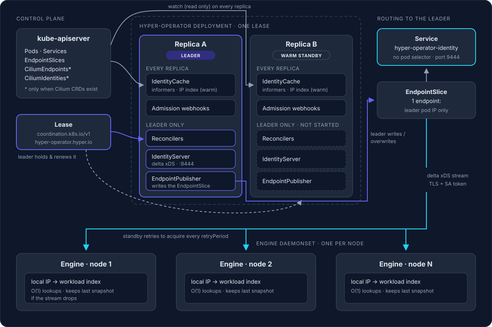
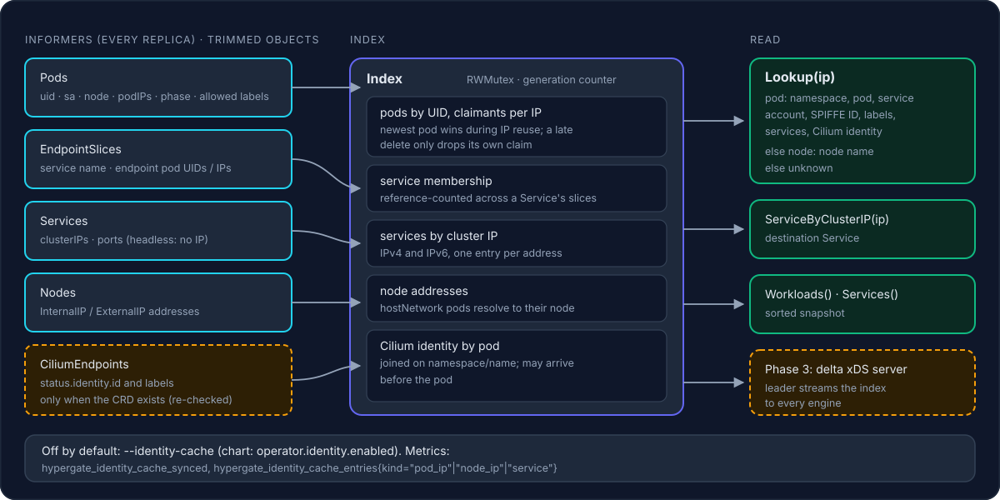

# Design: workload identity distribution

| | |
| --- | --- |
| Status | Accepted. Phases 1 and 2 done, Phase 3 next |
| Owner | hyper-operator |
| Scope | hyper-operator (new internal runnables), hypergate engine (identity client) |

## 1. Context

Hypergate selects a policy chain from the request path and headers. To route and enforce policy by **who is calling whom**, between services inside the cluster (east-west) as well as for traffic from outside (north-south), the engine has to know the workload behind a source IP and the service behind a destination.

Research and a Phase 0 spike established:

- **Destination never needs a lookup.** Envoy exposes `xds.cluster_name`, `xds.route_name` and route metadata at request-headers time (verified on official Envoy 1.36 and on Cilium's `cilium-envoy` 1.39 build). Routes Hypergate generates carry the destination service in route metadata.
- **Source identity cannot come from the proxy on Cilium.** Cilium's Envoy resolves the source security identity (`bpf_metadata`), but stores it in `CiliumPolicyFilterState`, which CEL cannot read. ext_proc's `MappedAttributeBuilder` is not compiled into `cilium-envoy`.
- Therefore the engine needs an **IP → workload identity map**, built centrally and distributed to every engine replica.

## 2. Decisions

| Topic | Decision |
| --- | --- |
| Where the map is built | Inside the existing **hyper-operator**, as new internal runnables. No new component or operator. |
| Leader election | Kubernetes **Lease API** through controller-runtime's manager (`hyper-operator.hyper.io` lease). Timings configurable, `LeaderElectionReleaseOnCancel` enabled. |
| Standby behaviour | **Warm standby.** Every replica watches the API and keeps its identity cache current. Only the **leader** serves the identity stream and writes the routing EndpointSlice. |
| Routing engines to the leader | A **selector-less Service** `hyper-operator-identity`, whose single EndpointSlice is written by the leader with only its own pod IP. |
| Identity without Cilium | SPIFFE ID `spiffe://cluster.local/ns/<namespace>/sa/<serviceaccount>` (trust domain configurable). |
| Identity with Cilium | Cilium numeric security identity plus its labels, **in addition to** the SPIFFE ID. |
| Engine authentication | Projected ServiceAccount token (audience `hypergate-identity`), validated by the operator with **TokenReview**. Server side TLS via cert-manager. |
| Transport | **Delta xDS** (go-control-plane, already a dependency) with Hypergate resource types. |
| eBPF | Not used for L7 filtering (see section 9). Possible later use for L3/L4 fast-path enforcement through CiliumNetworkPolicies. |

## 3. Architecture



Text version:

```
                         hyper-operator Deployment (N replicas, one Lease)
   ┌───────────────────────────────────────────────────────────────────────────────┐
   │  every replica                         │  leader only                          │
   │  ─────────────                         │  ───────────                          │
   │  existing webhooks                     │  existing controllers (reconcile)     │
   │  IdentityCache (informers: Pods,       │  IdentityServer  (delta xDS, :9444)   │
   │    Services, EndpointSlices,           │  LeaderEndpointPublisher              │
   │    CiliumEndpoints*, CiliumIdentities*)│    writes EndpointSlice of            │
   │    = warm standby                      │    Service hyper-operator-identity    │
   └───────────────────────────────────────────────────────────────────────────────┘
                     ▲ watch (read only)                    │ gRPC stream (TLS + SA token)
                 kube-apiserver                              ▼
                                               engine DaemonSet (one per node):
                                               local IP → identity index, O(1) lookups
   * only when the Cilium CRDs are installed
```

- **IdentityCache** runs on all replicas (controller-runtime runnable with `NeedLeaderElection() == false`). It keeps the index current, so a new leader serves within seconds of winning the Lease.
- **IdentityServer** and **LeaderEndpointPublisher** are leader-only runnables (`NeedLeaderElection() == true`). On standbys they are not started, so a misrouted connection is refused rather than served stale.
- Engines dial `hyper-operator-identity.<operator-namespace>.svc:9444`. They need no RBAC and no knowledge of leadership.

### Why a leader-managed EndpointSlice

| Alternative | Rejected because |
| --- | --- |
| Readiness gated on leadership | Readiness is per pod: standbys would also leave the webhook Service, and with `failurePolicy: Fail` admission would depend on a single pod. |
| Label on the leader pod plus a selector | A crashed leader keeps its label on the Pod object, so there can be two endpoints. |
| Engines read the Lease | Requires engine RBAC and leader lookup logic in every engine. |
| Connect anywhere, standbys redirect | Custom redirect protocol and more engine complexity. |

Only the Lease holder writes the EndpointSlice, so writes are fenced by leadership. The controller-runtime manager stops when leadership is lost, which closes the old leader's streams. Engines then reconnect through the Service to the new leader.

## 4. Data model



One resource per pod IP and one per service:

```proto
// hypergate.identity.v1
message Workload {
  string ip = 1;                 // resource name; one resource per pod IP (dual-stack: two resources)
  string pod_uid = 2;            // guards against IP reuse
  string namespace = 3;
  string pod = 4;
  string service_account = 5;
  string spiffe_id = 6;          // spiffe://<trust-domain>/ns/<ns>/sa/<sa>
  uint32 security_identity = 7;  // Cilium numeric identity, 0 without Cilium
  map<string,string> labels = 8; // selected labels only (configurable allow-list)
  repeated ServiceRef services = 9;
  string node = 10;
}

message ServiceRef {
  string namespace = 1;
  string name = 2;
}

message Service {
  string name = 1;               // resource name: <namespace>/<name>
  string namespace = 2;
  repeated string cluster_ips = 3;
  repeated uint32 ports = 4;
}
```

The resource version is the Kubernetes `resourceVersion` of the source object, so versions are identical across operator replicas. A reconnect to a new leader then transfers only the differences.

### Edge cases

| Case | Handling |
| --- | --- |
| Pod IP reused (delete and add events arrive out of order) | Index keyed by IP, entry carries the pod UID. A delete removes the entry only if the UID matches. |
| Terminating pod still sending traffic | Entry kept until the Pod object is deleted, not when `deletionTimestamp` is set. |
| Pod sends traffic before it is Ready | Identity comes from `status.podIPs`, available as soon as the sandbox has an IP, not from EndpointSlices. |
| `hostNetwork` pods | Not indexed as workloads; the node IP maps to `node:<name>`. |
| Pod in several services | `services` lists all of them (from EndpointSlices). |
| Dual-stack | One resource per IP. |
| Large clusters | Informer transforms strip Pod specs to the fields above; operator memory limit sized from Phase 5 measurements. |

## 5. Protocol

- Delta xDS (`DeltaAggregatedResources`) with type URLs `type.googleapis.com/hypergate.identity.v1.Workload` and `.../Service`. Engines subscribe with wildcard.
- On a new stream the engine sends its known resource versions, and the server answers with the differences (`resources` / `removed_resources`).
- Keepalives on both sides detect dead connections. Engines reconnect with jittered exponential backoff.

### Authentication

- The engine mounts a projected ServiceAccount token with audience `hypergate-identity` and sends it as gRPC metadata.
- The operator validates it with `TokenReview` (RBAC: `authentication.k8s.io/tokenreviews: create`). It accepts only the engine ServiceAccount(s) it manages, and caches positive results for the token's lifetime.
- TLS: server certificate issued by cert-manager (already used for the webhook). Engines verify it against the mounted CA.

## 6. Failover

| Event | Sequence | Expected duration |
| --- | --- | --- |
| Rolling upgrade / voluntary stop | Leader releases the Lease (`ReleaseOnCancel`) → standby acquires (retry period) → its cache is already warm → publishes EndpointSlice → engines reconnect | ≈ 2–5 s |
| Leader crash | Lease expires (lease duration) → standby acquires → publishes EndpointSlice → engines reconnect | ≈ lease duration + a few seconds (≈ 20 s with defaults) |
| Network partition of the leader | Leader cannot renew → stops before its lease expires (renew deadline < lease duration) → new leader | ≈ lease duration |

During failover engines keep serving from their last snapshot. Workloads created in that window resolve as `unknown`. A staleness metric reports the age of the last update.

## 7. Engine side

- `identity` config block: operator address, CA file, token file, maximum staleness.
- Local index with O(1) lookups; `RequestContext` gains source and destination identity.
- `/readyz` stays false until the first snapshot when chains use identity.
- `/debug/identity?ip=` on the health port for troubleshooting.
- Metrics: snapshot version, last update age, reconnects.

## 8. RBAC changes (operator)

- `pods`, `nodes`, `services`, `discovery.k8s.io/endpointslices`: get, list, watch (all replicas). Nodes resolve hostNetwork traffic.
- `cilium.io/ciliumendpoints`: get, list, watch (only used when the CRD exists). `CiliumIdentity` objects are not needed: a CiliumEndpoint's `status.identity` already carries the numeric identity and its labels.
- `discovery.k8s.io/endpointslices`: create, update, patch, delete in the operator namespace (leader writes the routing slice).
- `authentication.k8s.io/tokenreviews`: create.
- `coordination.k8s.io/leases`: already granted.

## 9. eBPF analysis (why filtering stays in Envoy)

| Requirement | In eBPF | Reason |
| --- | --- | --- |
| JWT validation | No | Needs base64 and JSON parsing and RSA/ECDSA verification. The verifier rejects unbounded loops (published L7 matchers reach only tens of bytes of payload). There is no RSA verification in the kernel, and ECDSA kfuncs are only being proposed. |
| CORS | No | Answering preflights means generating an HTTP response inside a TCP stream, and adding headers changes the stream length. Both need a terminating proxy. This is why Cilium hands L7 to Envoy. |
| Rate limiting | Partly | Per-IP or per-identity packet and connection limits are feasible (BPF map token buckets). Limits keyed on headers, users or API keys, and global Redis-backed limits, are not. |
| TLS / HTTP/2 | No | No TLS termination in the kernel. HPACK's dynamic table makes HTTP/2 header matching stateful. |

Possible future use: the operator generates CiliumNetworkPolicies from Hypergate routes, so unlisted callers are dropped at L3/L4 in the kernel before reaching Envoy. L7 stays in Envoy plus Hypergate.

## 10. Execution plan

| Phase | Work | Acceptance |
| --- | --- | --- |
| **1. Leader election hardening** | Configurable lease duration / renew deadline / retry period with validation; `LeaderElectionReleaseOnCancel`; `hypergate_operator_is_leader` metric; reusable leader-only and all-replica runnable helpers; chart and manifest values | Unit tests for option validation and runnable semantics; chart lint |
| **2. Identity cache (all replicas)** | Informers with transforms; Cilium CRD detection; IP and service index with the edge cases in section 4; RBAC | Fake-client tests: IP reuse, terminating pods, hostNetwork, dual-stack, multi-service pods, Cilium identities |
| **3. Distribution (leader only)** | Protobuf definitions (buf); delta xDS server; TLS + TokenReview; LeaderEndpointPublisher; selector-less Service in the chart | Integration test: snapshot, deltas, resume against a new leader, unauthenticated client rejected |
| **4. Engine client** | xDS client, local index, readiness gating, debug endpoint, metrics; operator passes connection settings to the DaemonSet | Engine unit tests; end-to-end test against an in-process operator server |
| **5. Failover and scale** | Kill leader, rolling upgrade, 10k simulated pods; measure failover, delta latency, memory | Rolling upgrade < 5 s, crash < 30 s, memory documented |
| **6. Documentation** | Concept page, failover diagram, operations runbook | Site builds |
| Next | Identity-aware routing (source/destination selectors, GAMMA wiring, per-traffic-class default chains) | [Separate design](./identity-aware-routing.md) |

### Progress

| Phase | Status | Notes |
| --- | --- | --- |
| 1 | **Done** | `hyper-operator/internal/leader`: `ElectionConfig` (flags `--leader-elect-lease-duration`, `--leader-elect-renew-deadline`, `--leader-elect-retry-period`, `--leader-elect-release-on-cancel`, `--leader-elect-lease-name`, `--leader-elect-namespace`, validated `retry < renew < lease`), `LeaderOnly` / `AllReplicas` runnable helpers, `hypergate_operator_is_leader` metric with transition logs. Chart values `operator.leaderElection.*`, metrics port exposed. Tests include a two-replica election through real controller-runtime managers sharing a Lease (fake clientset): the standby never runs leader-only work, warm-standby work runs everywhere, and a graceful stop hands over in well under the lease duration. |
| 2 | **Done** | [`hyper-operator/internal/identity`](../../hyper-operator/internal/identity): [`Index`](../../hyper-operator/internal/identity/index.go) (pods by UID with the claimants of each IP, newest pod wins during IP reuse and a late delete only drops its own claim; finished pods release their IPs; hostNetwork pods resolve to their node; one entry per IP for dual-stack; Service membership reference-counted across EndpointSlices; services by cluster IP; Cilium identity joined by pod name) and [`Cache`](../../hyper-operator/internal/identity/cache.go) (client-go informers with transforms that keep only the indexed fields, CiliumEndpoint CRD detection at start and every 5 minutes, all-replica runnable). Flags `--identity-cache` (default off until Phase 3 consumes it), `--identity-trust-domain`, `--identity-label-keys`; chart values `operator.identity.*` with conditional read-only RBAC; metrics `hypergate_identity_cache_synced` and `hypergate_identity_cache_entries{kind}`. Tests: index edge cases and informer-driven tests with fake clientset and dynamic client (IP reuse, late Cilium CRD). |
| 3–6 | Not started | |

## 11. Upstream dependencies and references

This design itself depends only on released components. The **consumer** of the identity map, east-west routing on Cilium, waits for an upstream pull request:

> **Waiting on upstream:** [cilium/cilium#46479](https://github.com/cilium/cilium/pull/46479) (`CiliumEnvoyExtProcFilter`, draft) and its CFP [cilium/cilium#45951](https://github.com/cilium/cilium/issues/45951). Until they land, the identity map can be built and distributed (Phases 2–5), and it is used by north-south routing through Envoy Gateway. See [identity-aware routing §2.1](./identity-aware-routing.md#21-upstream-pull-requests-we-are-waiting-for).

| Reference | Used for |
| --- | --- |
| [controller-runtime manager options](https://pkg.go.dev/sigs.k8s.io/controller-runtime) (`LeaderElection*`, `LeaseDuration`, `RenewDeadline`, `RetryPeriod`, `LeaderElectionReleaseOnCancel`) | Phase 1 |
| [client-go `resourcelock.LeaseLock`](https://pkg.go.dev/k8s.io/client-go/tools/leaderelection/resourcelock) | Lease-based election (and the Phase 1 two-replica test) |
| [Kubernetes Services without selectors](https://kubernetes.io/docs/concepts/services-networking/service/#services-without-selectors), [EndpointSlices](https://kubernetes.io/docs/concepts/services-networking/endpoint-slices/) | Routing engines to the leader (Phase 3) |
| [go-control-plane cache (delta xDS, custom resources)](https://pkg.go.dev/github.com/envoyproxy/go-control-plane/pkg/cache/v3) | Distribution protocol (Phase 3) |
| [TokenReview API](https://kubernetes.io/docs/reference/kubernetes-api/authentication-resources/token-review-v1/) | Engine authentication (Phase 3) |
| [cilium/proxy `bpf_metadata.cc`](https://github.com/cilium/proxy/blob/main/cilium/bpf_metadata.cc), [`filter_state_cilium_policy.h`](https://github.com/cilium/proxy/blob/main/cilium/filter_state_cilium_policy.h), [extensions build config](https://github.com/cilium/proxy/blob/main/envoy_build_config/extensions_build_config.bzl) | Why the source identity cannot come from Cilium's Envoy today (possible future upstream contribution) |

## 12. Repository map

| Area | Where |
| --- | --- |
| Identity index and informer cache (Phase 2) | [`hyper-operator/internal/identity/index.go`](../../hyper-operator/internal/identity/index.go), [`cache.go`](../../hyper-operator/internal/identity/cache.go), [`flags.go`](../../hyper-operator/internal/identity/flags.go) |
| Leader election config and runnable helpers (Phase 1) | [`hyper-operator/internal/leader/election.go`](../../hyper-operator/internal/leader/election.go), [`runnable.go`](../../hyper-operator/internal/leader/runnable.go), [tests](../../hyper-operator/internal/leader/election_test.go) |
| Operator entry point (flags, manager) | [`hyper-operator/cmd/main.go`](../../hyper-operator/cmd/main.go) |
| Helm values (`operator.leaderElection.*`, `operator.metricsPort`, `operator.identity.*`) | [`charts/hyper-operator/values.yaml`](../../charts/hyper-operator/values.yaml), [`templates/deployment.yaml`](../../charts/hyper-operator/templates/deployment.yaml) |
| Static manifests | [`hyper-operator/deploy/deployment.yaml`](../../hyper-operator/deploy/deployment.yaml), [`rbac.yaml`](../../hyper-operator/deploy/rbac.yaml) |
| Engine client IP resolution (consumer side) | [`internal/clientip/clientip.go`](../../internal/clientip/clientip.go) |
| Engine request context (gains identity fields in Phase 4) | [`internal/engine/context.go`](../../internal/engine/context.go) |
| Operator HA operations guide | [`website/docs/reference/operations.md`](../../website/docs/reference/operations.md) |
| Routing design (consumer of the map) | [`identity-aware-routing.md`](./identity-aware-routing.md) |

## 13. Risks

- **IP identity is only as strong as the network.** It is trustworthy where the CNI prevents spoofing (Cilium does). mTLS identity would be stronger and is out of scope here.
- **Every replica watches Pods cluster-wide** (warm standby). This is the price of fast failover. Watches are read-only, and with 2–3 replicas the API server load is small.
- **Unknown sources during failover or for brand-new pods** need an explicit policy in the routing phase.
